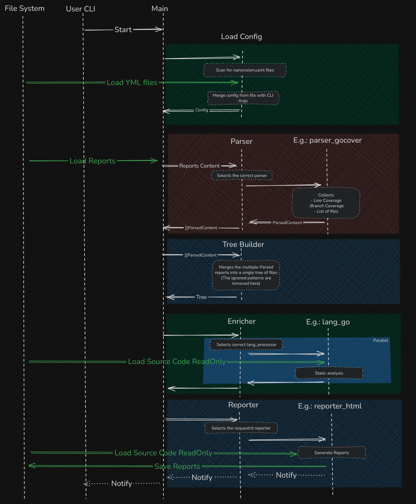

# Contributing to **nanovision**

Thanks for taking the time to contribute! 

This project is a **Go CLI** with a **React** subproject for HTML reports. We provide cross‑platform scripts, a devcontainer, and end‑to‑end tests to keep contributions smooth and consistent.

> [!NOTE]  
> New to open source? No worries! This guide will walk you through everything step by step.

## Code of Conduct

This project follows a [Code of Conduct](CODE_OF_CONDUCT.md). By participating, you agree to abide by it.

## Quick Start (TLDR)

1. Fork and clone the repo
2. Setup locally or open in the **devcontainer**
3. Make your changes
4. Build and Test: `python ./scripts/e2e_test.py -sc`
5. Open a PR with a clear description

## Project Layout

```
/                  
├─ .devcontainer/ # devcontainer config
├─ cmd/           # CLI entry points
├─ internal/      # private Go packages
├─ ui/            # React subproject (used for HTML reports)
├─ scripts/       # helper scripts (build, test, e2etest, ...)
├─ vendor/        
├─ README.md
└─ ...
```

<details>
<summary>How nanovision works (click to expand)</summary>

A simplified diagram that shows the main parts of the system:

1. **Configuration loading:**
   - CLI arguments will overwrite the settings in the config file.
2. **Report parsing:**
   - Collects:
     - Line coverage.
     - Branch coverage.
     - List of files touched by the reports.
3. **Enricher:**
   - Uses **tree-sitter** for static analysis of each covered file from the source code, and collects some extra information.
     - Function/method start and finish lines.
     - Cyclomatic complexity.
     - Other metrics as applicable.
   - Each supported programming language has its own analyzer with potentially different features.
4. **Reporter:**
   - Uses the collected information from the previous steps to generate the requested reports.



</details>

## Before You Start

> [!IMPORTANT]  
> Search existing **issues** and **PRs** to avoid duplicates before starting work.

* For non‑trivial changes, open an **issue** or **discussion** first to align on direction.
* Make sure you can **build and test** locally (see below) or use the **devcontainer**.

## Development Setup

> [!TIP]
> Use the devcontainer for a pre-configured environment. It saves setup time and ensures consistency.

### Requirements

Native setup works on macOS/Linux/Windows:

* **Go:** ≥ **1.25**
* **Python:** ≥ **3.x**
* **Node.js:** ≥ **20.x**
  * Only for the React project, not necessary if you are not touching the UI side.
* **Package manager (web):** `pnpm` (preferred) or `npm`/`yarn`
* **C/C++ toolchain (for Windows build only):** MinGW-w64 on `PATH` providing `x86_64-w64-mingw32-gcc`/`g++`.
  * On **Windows**, use MSYS2 MinGW-w64.
  * On **macOS/Linux** (cross-compiling to Windows), use the MinGW-w64 cross-compiler.
  * **Linux build (`--linux`)**: no C/C++ toolchain needed unless you enable CGO yourself.

### Basic Commands

```bash
# Clone
git clone https://github.com/IgorBayerl/nanovision.git
cd nanovision

# Build snapshot (binaries in bin/)
goreleaser release --snapshot --clean

# Generates many reports based on the example projects
python ./scripts/e2e_test.py 
```

### Building

#### 1. Local Development (Fast)

For daily development, use the Python script to build for your current platform (or Windows x64 if on Linux). This uses your local Go installation.

```bash
# Build for both Linux and Windows (x64 only)
python3 scripts/build.py

# Build for specific target
python3 scripts/build.py --target linux
```

#### 2. Full Release (Cross-Platform)

To build for all platforms (including ARM64) and publish a release:

1. Go to the **Actions** tab in GitHub.
2. Select the **Release** workflow.
3. Click **Run workflow**.
4. Enter the version (e.g., `v0.1.1`) and optional commit SHA.

This triggers a cloud build using `goreleaser-cross` to generate all artifacts.

#### 3. Test Release Locally (Docker)

You can simulate the CI release process locally using Docker. This builds all binaries (Windows/Linux, AMD64/ARM64) and places them in the `bin/` folder.

**PowerShell (Windows):**
```powershell
docker run --rm --privileged `
  -v "${PWD}:/src" `
  -w /src `
  ghcr.io/goreleaser/goreleaser-cross:v1.25.3 `
  release --clean --snapshot --skip=publish
```

**Bash (Linux/macOS):**
```bash
docker run --rm --privileged \
  -v "$PWD:/src" \
  -w /src \
  ghcr.io/goreleaser/goreleaser-cross:v1.25.3 \
  release --clean --snapshot --skip=publish
```

### 4. Winget Release Automation

The project is configured to automatically submit new releases to the [Windows Package Manager Community Repository](https://github.com/microsoft/winget-pkgs).

**Prerequisites:**
- A GitHub Personal Access Token (PAT) with `public_repo` scope.
- This token must be added as a repository secret named `WINGET_TOKEN`.

**Workflow:**
- The workflow is defined in `.github/workflows/winget.yml`.
- It triggers automatically when a release is **published** (not drafted).
- It uses the `vedantmgoyal2009/winget-releaser` action to create a PR against `winget-pkgs`.


---

## Using the Devcontainer

We ship a **.devcontainer** configuration (VS Code compatible) so contributors can get a ready‑to‑run environment.

1. Install **Docker** and **VS Code** with the **Dev Containers** extension.
2. Open the repository in VS Code. 
   - VSCode should prompt you with **Reopen in Container**.
   - Or press `Ctrl + Shift + P` and run **Dev Containers: Build and Reopen in Containers**
3. The container comes with Go, Node, Python, C Compiler and tooling preinstalled (see `.devcontainer/devcontainer.json`).

> [!NOTE]  
> CI uses a similar toolchain to the devcontainer to reduce "works on my machine" issues.

---

## Scripts

Project automation lives under `scripts/`:

| Script | Purpose |
|--------|---------|
| `python scripts/build.py` | Build local binaries (x64) |
| `test.py` | Run unit tests |
| `e2e_test.py` | Run end-to-end tests with example reports |
| `e2e_test.py -sc` | Run E2E tests and generate self-coverage report |

---

## Testing

### Unit tests

```bash
python ./scripts/test.py
```

### End-to-end tests

```bash
python ./scripts/e2e_test.py -sc
```

> [!TIP]
> The `-sc` flag generates a self-coverage report. This helps verify that nanovision can analyze its own codebase.

---

## Continuous Integration (GitHub Actions)

**GitHub Actions** handles CI/CD. There are two workflows in `.github/workflows/`:

### [PR Check](https://github.com/IgorBayerl/nanovision/actions/workflows/pr_checks.yml)

**Trigger:** Pull Requests

**What it does:**

- Runs a **try build** of the **docs** and the **self report** (no publishing)
- Executes relevant checks/tests (Go unit, web tests, E2E if configured)
- Uploads build **artifacts** for PR reviewers where applicable

**Intent:** Fast feedback to maintainers and contributors before merge.

### [Publish Docs and Self Report](https://github.com/IgorBayerl/nanovision/actions/workflows/pages.yml)

**Trigger:** Every **push to `main`**

**What it does:**

- Performs the same **build** as `pr_check`
- **Publishes** the built **docs** and **self report** to **GitHub Pages**

<details>
<summary>CI/CD Architecture Details (click to expand)</summary>

The project uses **reusable GitHub Actions** to keep workflows clean:

- **build-docs** action: Builds MkDocs site
- **build-report** action: Runs E2E tests and generates self-coverage report

Both workflows use these actions to ensure consistency between PR checks and production deployments.

The final site structure on GitHub Pages:
```
/
├─ docs/      # Documentation
├─ reports/   # Self-coverage reports
└─ index.html # Landing page
```

</details>

---

## Making Your First Contribution

### Step 1: Find Something to Work On

- Browse [open issues](https://github.com/IgorBayerl/nanovision/issues)
- Look for issues labeled `good first issue` or `help wanted`
- Check existing [pull requests](https://github.com/IgorBayerl/nanovision/pulls) to avoid duplicate work

### Step 2: Fork and Clone

```bash
# Fork the repo on GitHub, then:
git clone https://github.com/YOUR_USERNAME/nanovision.git
cd nanovision
```

### Step 3: Create a Branch

```bash
git checkout -b feature/your-feature-name
# or
git checkout -b fix/your-bug-fix
```

> [!TIP]
> Use descriptive branch names like `fix/coverage-parser-crash` or `feature/add-rust-support`.

### Step 4: Make Your Changes

- Write clear, simple code
- Add tests for new features
- Update documentation if needed

### Step 5: Test Your Changes

```bash
# Run tests
python ./scripts/test.py

# Run E2E tests with self-coverage
python ./scripts/e2e_test.py -sc
```

> [!WARNING]  
> PRs without passing tests will not be merged. Make sure all tests pass before submitting.

### Step 6: Commit Your Changes

```bash
git add .
git commit -m "Clear description of what you changed"
```

**Good commit messages:**
- `fix: handle empty coverage files correctly`
- `feat: add support for Python branch coverage`
- `docs: update installation instructions`

### Step 7: Push and Create PR

```bash
git push origin feature/your-feature-name
```

Then open a pull request on GitHub with:
- A clear title
- Description of what changed and why
- Reference any related issues (e.g., "Fixes #123")

---

## Reporting Bugs

Found a bug? Help us fix it!

1. Check if it's already reported in [issues](https://github.com/IgorBayerl/nanovision/issues)
2. If not, [create a new bug report](https://github.com/IgorBayerl/nanovision/issues/new?template=bug_report.md)

### What to Include in Bug Reports

> [!IMPORTANT]  
> Good bug reports help us fix issues faster.

Include:
- Console output of **nanovision** with the `--verbose` flag
- Your operating system and nanovision version
- Steps to reproduce the issue
- Expected vs actual behavior

**For coverage file parsing issues:**
- Share the coverage file (publicly or privately to `dev.igorbayerl@gmail.com`)
- Small files: attach directly
- Large files: share via Dropbox, Google Drive, etc.

---

## Security

> [!CAUTION]
> Never open public issues for security vulnerabilities.

Report security issues privately to `dev.igorbayerl@gmail.com`. We take security seriously and will respond promptly.

---

## Getting Help

Stuck? Here's how to get help:

- **Questions:** Open a [discussion](https://github.com/IgorBayerl/nanovision/discussions)
- **Bugs:** Create an [issue](https://github.com/IgorBayerl/nanovision/issues)
- **Email:** `dev.igorbayerl@gmail.com`

> [!NOTE]  
> We're here to help! Don't hesitate to ask questions, especially if you're new to the project.

---

## License

By contributing, you agree your contributions are licensed under the [Apache 2.0 License](LICENSE).

---

## What Happens After You Submit a PR?

1. **Automated checks run:** CI will build and test your changes
2. **Code review:** A maintainer will review your code
3. **Feedback:** We may ask for changes or clarifications
4. **Merge:** Once approved and tests pass, we'll merge your PR
5. **Celebration:** Your contribution is now part of nanovision! 🎉

> [!TIP]
> Be patient during code review. Maintainers are volunteers and may take a few days to respond.

---

**Thanks for contributing to nanovision!** Every contribution, big or small, helps make this project better.