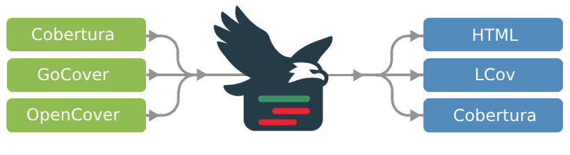

<h1 align="center">


<br/>
AdlerCov
</h1>


<div align="center">
    
<b>Powerful code coverage visualization</b>
  
</div>

[](https://goreportcard.com/report/github.com/IgorBayerl/AdlerCov)

**AdlerCov** converts coverage reports generated by Cobertura, GoCover, OpenCover or lcov into human readable reports in various formats.

The reports show the coverage quotas and also visualize which lines of your source code have been covered.


**AdlerCov** supports merging several coverage files into a single report.

Originally a Go port of the excellent [ReportGenerator](https://github.com/danielpalme/ReportGenerator) by Daniel Palme, **AdlerCov** has grown into a standalone, forward-looking tool. Built in Go, it focuses on performance, simplicity - tailored for today’s development workflows.



## Motivation

[ReportGenerator](https://github.com/danielpalme/ReportGenerator) is a mature and feature-rich tool that has served the .NET ecosystem for over **14 years**. Its robustness and design inspired this project, which started as a Go port but has since evolved into something more.

The motivations for creating **AdlerCov**:

1. **For Study:** Originally an effort to explore not just coverage formats and report generation, but also the challenges of translating a project from one language to another - while keeping the result idiomatic and aligned with best practices in the target language (Go).
2. **Dependency-Free:** A lightweight, native binary that runs anywhere without .NET or external runtimes - ideal for containers and CI/CD pipelines.
3. **Modern Extensibility:** Designed in Go with clean architecture, enabling rapid extension for new formats and native Go features like `coverage.out`.

## Feature Status

While AdlerCov began by mirroring ReportGenerator’s capabilities, it is now diverging with Go-native enhancements and a growing list of planned features.

| Feature Category   | Feature                         | ReportGenerator   | AdlerCov  | Notes                         |
| :----------------- | :------------------------------ | :---------------: | :-------: | :---------------------------- |
| **Input Formats**  | Cobertura                       |        ✅        |     ✅    | Core support.                 |
|                    | Go Cover                        |        ❌        |     ✅    | Native `coverage.out` parser. |
|                    | OpenCover                       |        ✅        |     ❌    | Planned.                      |
|                    | LCov                            |        ✅        |     ❌    | Planned.                      |
|                    | JaCoCo                          |        ✅        |     ❌    | Planned.                      |
|                    | Multiple/Merged Reports         |        ✅        |     ✅    | Supports unified summaries.   |
| **Output Formats** | HTML (SPA)                      |        ✅        |     ✅    | Angular frontend.             |
|                    | TextSummary, lcov               |        ✅        |     ✅    | Fully supported.              |
|                    | Badge                           |        ✅        |     ❌    | Coming soon.                  |
|                    | JSON                            |        ✅        |     ❌    | Coming soon.                  |
|                    | XML                             |        ✅        |     ❌    | Coming soon.                  |
| **Core Features**  | Assembly/Class/File Filtering   |        ✅        |     ✅    | Implemented.                  |
|                    | Branch & Method Coverage        |        ✅        |     ✅    |                               |
|                    | Cyclomatic Complexity           |        ✅        |     ✅    | Gocover/Cobertura             |
|                    | History / Trend Charts          |        ✅        |     ❌    | Not yet implemented.          |
|                    | Risk Hotspots                   |        ✅        |     ❌    | Not yet implemented.          |
|                    | Raw Mode (no merging)           |        ✅        |     ❌    | Planned.                      |

## Command Line Interface

AdlerCov mirrors the familiar command-line interface of ReportGenerator while following idiomatic Go CLI patterns.

| Argument                           | ReportGenerator | AdlerCov | Description              |
| :--------------------------------- | :-------------: | :------: | :----------------------- |
| `report`                           |        ✅      |     ✅   | Input coverage reports.  |
| `output`                           |        ✅      |     ✅   | Output directory.        |
| `sourcedirs`                       |        ✅      |     ✅   | Optional source paths.   |
| `reporttypes`                      |        ✅      |     ✅   | Output formats.          |
| `assemblyfilters`                  |        ✅      |     ✅   | Include/exclude filters. |
| `classfilters`                     |        ✅      |     ✅   | Include/exclude filters. |
| `filefilters`                      |        ✅      |     ✅   | Include/exclude filters. |
| `verbosity`                        |        ✅      |     ✅   | Log level.               |
| `tag`                              |        ✅      |     ✅   | Optional label.          |
| `title`                            |        ✅      |     ✅   | Custom report title.     |
| `riskhotspotassemblyfilters`       |        ✅      |     ✅   | Filters for hotspots.    |
| `riskhotspotclassfilters`          |        ✅      |     ✅   | Filters for hotspots.    |
| `historydir`                       |        ✅      |     ❌   |  TODO                    |
|  `plugins`                         |        ✅      |     ❌   |  TODO                    |

## Why "AdlerCov"?

The name **AdlerCov** combines **“Adler”** (German for **eagle**) with **coverage**, evoking the image of a high-flying, sharp-eyed bird analyzing your entire codebase. It reflects the project's mission: to help developers detect weaknesses and gaps in their test coverage with clarity and accuracy.

## How to Contribute

This project is actively evolving - your contributions are highly valued! Whether you're:

* Porting features you need from ReportGenerator
* Adding new input/output formats
* Optimizing
* Writing tests
* Adding example projects

I would love your help.

### System Design

AdlerCov is built around modular design principles, enabling easy expansion and maintenance.

* **Entrypoint (`cmd/main.go`):** Orchestrates the app lifecycle, parses CLI args, and composes required components like parsers and processors.
* **Configuration (`internal/reportconfig`, `internal/settings`):** Centralized management for user inputs, output directories, filters, and report types.
* **Parser Factory (`internal/parsers`):** Accepts a list of parser implementations (e.g., Cobertura, GoCover) and selects the correct one per file.
* **Language Processors (`internal/language`):** Understands language-specific behavior (e.g., formatting `.cs` vs `.go`) and metrics like cyclomatic complexity.
* **Intermediate Model (`internal/model`):** A standardized format to decouple input parsing from output generation.
* **Analyzer (`internal/analyzer`):** Merges parsed reports into a unified summary, allowing for combined views across test runs or languages.
* **Reporters (`internal/reporter`):** Converts processed data into human-readable outputs like HTML or text summaries.
* **Angular SPA (`angular_frontend_spa`):** A full-featured, dynamic frontend for exploring results with filtering, sorting, and collapsible sections.

## Getting Started & Development

This section guides you through setting up the project for local development and contribution.

### Development Environment Prerequisites

To work on this project, you will need certain tools installed depending on what you want to do.

*   **Go (Required):** You must have Go version 1.23 or higher installed to build and run the core AdlerCov application.
*   **Python (Optional):** Needed to run the `generate_reports.py` script located in the `Testprojects` directory. This script is used to generate sample coverage reports for testing.
*   **Node.js & Angular CLI (Optional):** If you plan to modify the frontend of the HTML report, you will need Node.js and the Angular CLI to build the Angular single-page application located in the `internal/assets/angular_frontend_spa` directory.
*   **.NET SDK (Optional):** Required by the `generate_reports.py` script to build the C# test project and generate its coverage data.

### 1. Clone the Repository

First, clone the project to your local machine using git:

```bash
git clone https://github.com/IgorBayerl/AdlerCov.git
cd AdlerCov
```

### 2. Run Locally

You can run the application directly without building a binary using `go run`. This is the recommended approach for development and quick testing.

To see all available command-line flags:
```bash
go run ./cmd/main.go --help
```

To run with a sample report (you may need to generate it first using the `generate_reports.py` script):
```bash
go run ./cmd/main.go --report="Testprojects/Go/coverage.cobertura.xml" --output="reports/go_report"
```

### 3. Build the Binary

To compile the project into a single executable binary, use the `go build` command:

Linux / Mac
```bash
go build -o adlercov ./cmd/main.go
```

Windows
```powershell
go build -o adlercov.exe ./cmd/main.go
```
This will create an executable file named `adlercov` (or `adlercov.exe` on Windows) in the root directory. You can then run it directly:

```bash
./adlercov --report="path/to/your/coverage.xml" --output="your_report_directory"
```

### Feature Requests

If you're missing a feature from the original ReportGenerator or have new ideas, please [open an issue](https://github.com/IgorBayerl/AdlerCov/issues) and include:

1. Feature description
2. Reference (link or example from ReportGenerator)
3. Sample CLI usage
4. Sample input/output if possible

This context makes implementation much smoother.


## License
- **AdlerCov** is licensed under the [Apache License, Version 2.0](https://opensource.org/licenses/Apache-2.0)