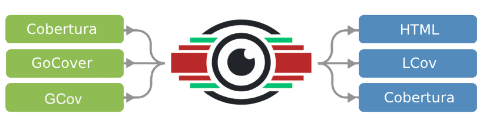
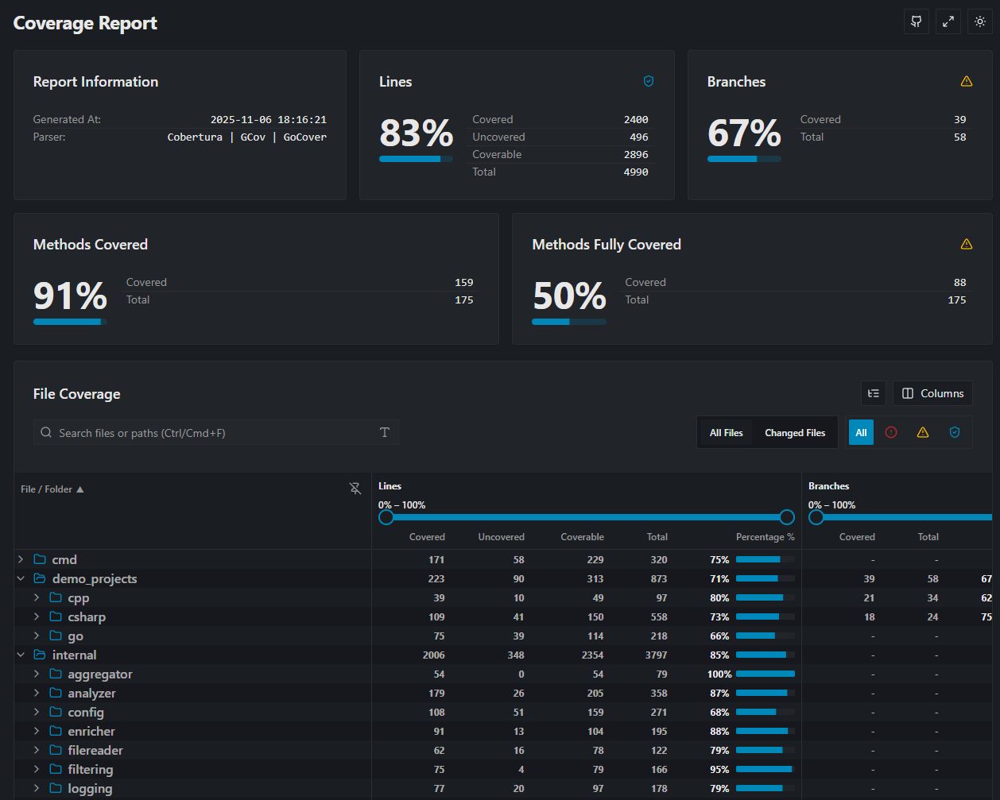
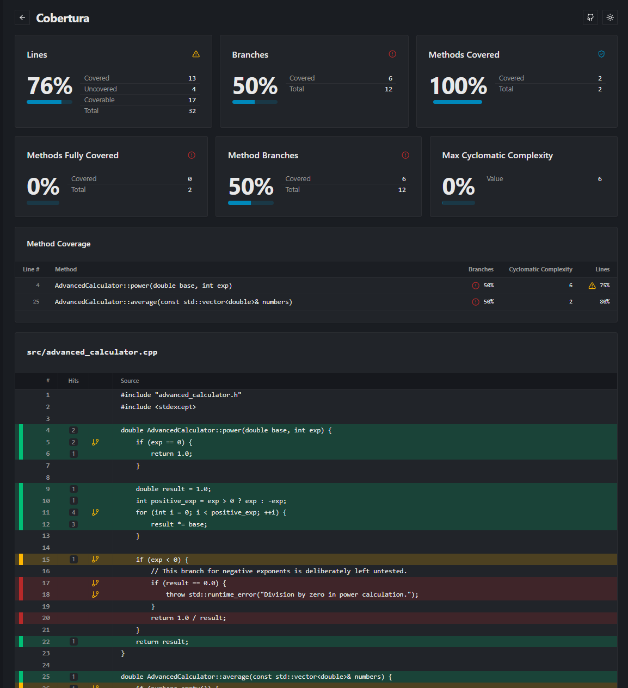

**nanovision** converts coverage reports generated by Cobertura, GoCover or GCov into human-readable reports in various formats.

The reports show the coverage quotas and also visualize which lines of your source code have been covered.

**nanovision** supports merging several coverage files into a single report, giving you a unified view of your project's test coverage across different test suites (e.g., unit and integration tests).

Originally a Go rewrite of the excellent [ReportGenerator](https://github.com/danielpalme/ReportGenerator) by Daniel Palme, **nanovision** has evolved into something different. Built in Go, it focuses on performance, simplicity, and a fresh clean architecture focused on today's workflow.

---

Here is an [example report](https://igorbayerl.github.io/nanovision/reports/), its a self coverage report of the **nanovision** project.


## Screenshots 


### HTML Report

Summary


Details

## Feature Status


While nanovision began by mirroring ReportGenerator’s capabilities, it is now diverging with Go-native enhancements and a growing list of planned features.

| Feature Category   | Feature               | nanovision | Notes          |
|:-------------------|:----------------------|:----------:|:---------------|
| **Input Formats**  | Cobertura             |     ✅      |                |
|                    | Go Cover              |     ✅      |                |
|                    | OpenCover             |     ❌      | Planned.       |
|                    | JaCoCo                |     ❌      | Planned.       |
|                    | Merge Reports         |     ✅      |                |
| **Output Formats** | HTML (SPA)            |     ✅      |                |
|                    | TextSummary           |     ✅      |                |
|                    | lcov                  |     ✅      |                |
|                    | RawJSON               |     ✅      |                |
|                    | Badge                 |     ❌      | Coming soon.   |
|                    | XML                   |     ❌      | Coming soon.   |
| **Core Features**  | File Filtering        |     ✅      |                |
|                    | Report Selection      |     ✅      |                |
|                    | Branch Coverage       |     ✅      |                |
|                    | Method Coverage       |     ✅      |                |
|                    | Cyclomatic Complexity |     ✅      | Go-native; C++ |
|                    | Patch Coverage        |     ❌      | Coming soon.   |
|                    | Risk Hotspots         |     ❌      | Coming soon.   |

## Command Line Interface

nanovision mirrors the familiar command-line interface of ReportGenerator while adding a config file as well `nanovision.yaml`.

| Argument      | nanovision | Description                                   |
|:--------------|:----------:|:----------------------------------------------|
| `report`      |     ✅      | Input coverage reports (semicolon-separated). |
| `output`      |     ✅      | Output directory.                             |
| `sourcedirs`  |     ✅      | Source directories (semicolon-separated).     |
| `reporttypes` |     ✅      | Output formats (comma-separated).             |
| `filefilters` |     ✅      | Include/exclude file filters.                 |
| `verbosity`   |     ✅      | Log level (e.g., Verbose, Info, Error).       |
| `tag`         |     ✅      | Optional label for the report.                |
| `title`       |     ✅      | Custom report title.                          |

### Config file example
```yaml
# A list of coverage report files to parse for the merged report.
reports:
  - "reports/nanovision_self_coverage/coverage-unit.out"
  - "reports/nanovision_self_coverage/coverage-integration.out"
  - "demo_projects/cpp/report/gcov/branch-probabilities/*.gcov"
  - "demo_projects/csharp/report/cobertura/cobertura.xml"
  - "demo_projects/go/report/gocover/coverage.out"

# A list of source code directories. The order must match the `reports` list.
source_dirs:
  - "."
  - "."
  - "demo_projects/cpp/project"
  - "demo_projects/csharp/project"
  - "demo_projects/go/project"

# The directory where the final self-coverage report will be saved.
output_dir: "reports/nanovision_self_coverage_full"

# The types of reports to generate.
report_types:
  - "Html"
  - "TextSummary"
  - "Lcov"
  - "RawJson"

# The title for the generated HTML report.
title: "nanovision Self-Coverage (Full Merged)"

# Logging verbosity for the self-coverage run.
verbosity: "Verbose"

# A list of glob patterns for files and directories to exclude from the report.
ignore_files:
  - "tree-sitter/**"       # Exclude all downloaded tree-sitter grammars
  - "**/*_test.go"         # Exclude test files themselves from coverage metrics
  - "tools/**"             # Exclude helper tools
  - "vendor/**"            # Exclude vendored dependencies
```

## Why "nanovision"?

Reference to Crysis thermal vision capability, used in game to spot threats.

## How to Contribute

Check the [CONTRIBUTING.md](contributing.md)

## License
**nanovision** is licensed under the [Apache License, Version 2.0](https://opensource.org/licenses/Apache-2.0)