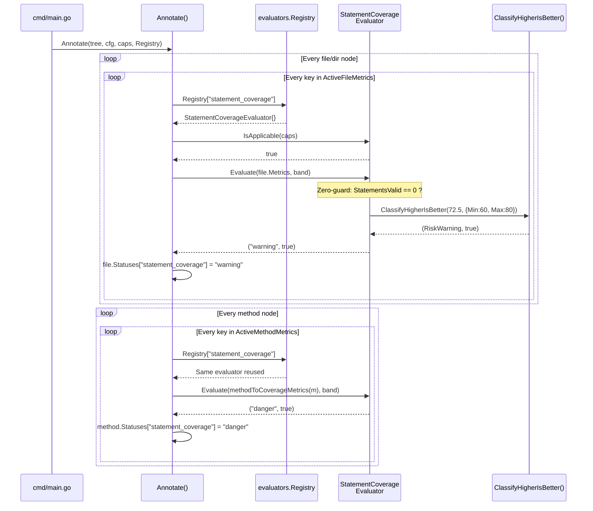
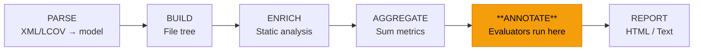
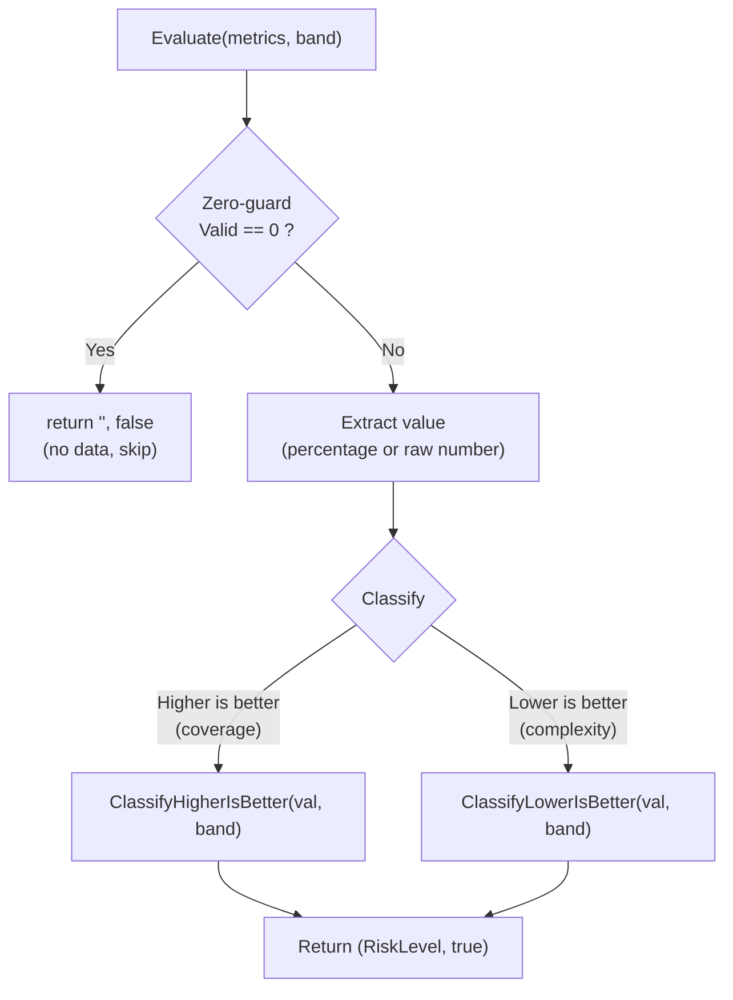

# What is an Evaluator?

An **Evaluator** is a small struct that answers one question: *"For this metric, how risky is this node?"* It takes raw coverage numbers (e.g. 70 statements covered out of 100) and classifies them into a risk level: **danger**, **warning**, or **safe** — based on user-configured thresholds.

Each evaluator is **self-documenting**: it carries its own name, description, and supported scopes, making it the single source of truth for that metric's identity and documentation.

---

## The Interface

```go
// internal/status/evaluator.go
type Evaluator interface {
    Key() config.MetricKey          // "statement_coverage"
    Name() string                   // "Statement Coverage"
    Description() string            // "Percentage of executed statements."
    SupportedScopes() []MetricScope // [FileScope, MethodScope]

    IsApplicable(caps Capabilities) bool
    Evaluate(metrics model.CoverageMetrics, band *config.Band) (RiskLevel, bool)
}
```

| Method | Purpose |
|--------|---------|
| [Key()](file:///c:/www/nanovision/internal/status/evaluators/complexity.go#12-13) | The config key users write in YAML |
| [Name()](file:///c:/www/nanovision/internal/status/evaluators/complexity.go#13-14) / [Description()](file:///c:/www/nanovision/internal/status/evaluators/patch_statement_coverage.go#15-16) / [SupportedScopes()](file:///c:/www/nanovision/internal/status/evaluators/line_coverage.go#16-19) | Powers `--list-metrics` and the boot log |
| [IsApplicable(caps)](file:///c:/www/nanovision/internal/status/evaluators/patch_line_coverage.go#20-21) | Guards against data that doesn't exist (e.g. skip branch coverage if the parser didn't produce branch data) |
| [Evaluate(metrics, band)](file:///c:/www/nanovision/internal/status/evaluators/methods_fully_covered.go#25-32) | The core: extract a number, classify it against the threshold band |

---

## Lifecycle: How an Evaluator Runs



---

## Where Evaluators Sit in the Pipeline



Evaluators run in the **ANNOTATE** stage — after all data is collected and aggregated, but before any report is generated. They stamp each node with risk statuses that reporters simply read.

---

## Anatomy of an Evaluator

Every evaluator follows the same 3-step pattern inside [Evaluate()](file:///c:/www/nanovision/internal/status/evaluators/methods_fully_covered.go#25-32):



**Real example** — [statement_coverage.go](file:///c:/www/nanovision/internal/status/evaluators/statement_coverage.go):

```go
func (StatementCoverageEvaluator) Evaluate(m model.CoverageMetrics, band *config.Band) (status.RiskLevel, bool) {
    // 1. Zero-guard
    if m.StatementsValid == 0 { return "", false }

    // 2. Extract value
    pct := utils.CalculatePercentage(m.StatementsCovered, m.StatementsValid, 2)

    // 3. Classify
    return status.ClassifyHigherIsBetter(pct, band)
}
```

**vs.** [complexity.go](file:///c:/www/nanovision/internal/status/evaluators/complexity.go) (lower-is-better):

```go
func (MaxComplexityEvaluator) Evaluate(m model.CoverageMetrics, band *config.Band) (status.RiskLevel, bool) {
    if m.MaxCyclomaticComplexity == 0 { return "", false }
    return status.ClassifyLowerIsBetter(float64(m.MaxCyclomaticComplexity), band)
}
```

---

## Classification Logic

The user sets thresholds via `status_bands` in YAML:

```yaml
status_bands:
  statement_coverage: "60..80"    # Min=60, Max=80
  max_cyclomatic_complexity: "5..10"
```

| Classifier | val < Min | Min ≤ val ≤ Max | val > Max |
|------------|-----------|-----------------|-----------|
| [ClassifyHigherIsBetter](file:///c:/www/nanovision/internal/status/classifier.go#5-24) | 🔴 danger | 🟡 warning | 🟢 safe |
| [ClassifyLowerIsBetter](file:///c:/www/nanovision/internal/status/classifier.go#25-44) | 🟢 safe | 🟡 warning | 🔴 danger |

If no band is configured → [("", false)](file:///c:/www/nanovision/internal/status/evaluators/complexity.go#12-13) → no status badge appears.

---

## When Should You Create a New Evaluator?

Create a new evaluator when you have a **numeric metric** that:

1. **Exists in `model.CoverageMetrics`** — there must be raw data to evaluate
2. **Has a meaningful "good vs bad" direction** — either higher-is-better or lower-is-better
3. **Benefits from threshold-based risk coloring** — users want danger/warning/safe badges

### Yes, create one for:
- A new coverage percentage (patch branch coverage, function coverage, etc.)
- A new code quality number (max nesting depth, average complexity, etc.)

### No, don't create one for:
- **Display-only metrics** like `method_branch_coverage` that are computed and shown in reports but don't need risk classification
- **Counts without a meaningful threshold** — e.g. "total lines of code" (no concept of danger/safe)
- **Boolean flags** — evaluators work on numeric ranges, not yes/no values

---

## The Registry & Self-Documentation

Once you create an evaluator and add it to the registry:

```go
// internal/status/evaluators/registry.go
var Registry = map[config.MetricKey]status.Evaluator{
    config.StatementCoverage: StatementCoverageEvaluator{},
    // ... your new evaluator goes here
}
```

Three things happen automatically:
1. ✅ Users can configure it in YAML (`file_metrics` / `method_metrics`)
2. ✅ `--list-metrics` shows it with its [Description()](file:///c:/www/nanovision/internal/status/evaluators/patch_statement_coverage.go#15-16)
3. ✅ The boot log shows `[x]`/`[ ]` based on whether it's enabled
